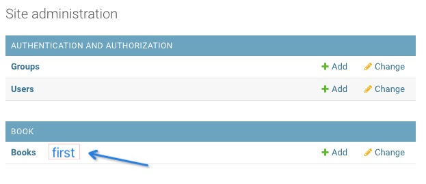
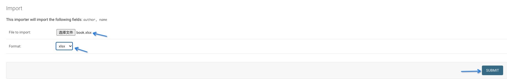
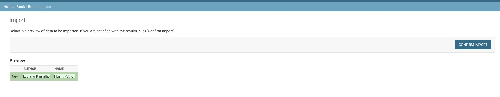

# Description
## enviroment and package
### package
 - python==3.8
 - django==3.2.2
 - django-import-export==2.5.0
 - mysqlclient==2.0.3
### platform
- Mac OS 11.2.3
- mysql 8.0.23 & 5.6.23
## step
### first
```
python manage.py makemigrations
python manage.py migrate
python manage.py migrate --database=book_db
python manage.py createsuperuser
```
### second
Open the browser and enter the management interface and click on the book column


Click the import button


Select the book.xlsx file in the project folder, and then click Submit


On this page, you can view the database. Obviously the data has been inserted into the database, but this is not the result I want


# end
I don't know how to solve this problem